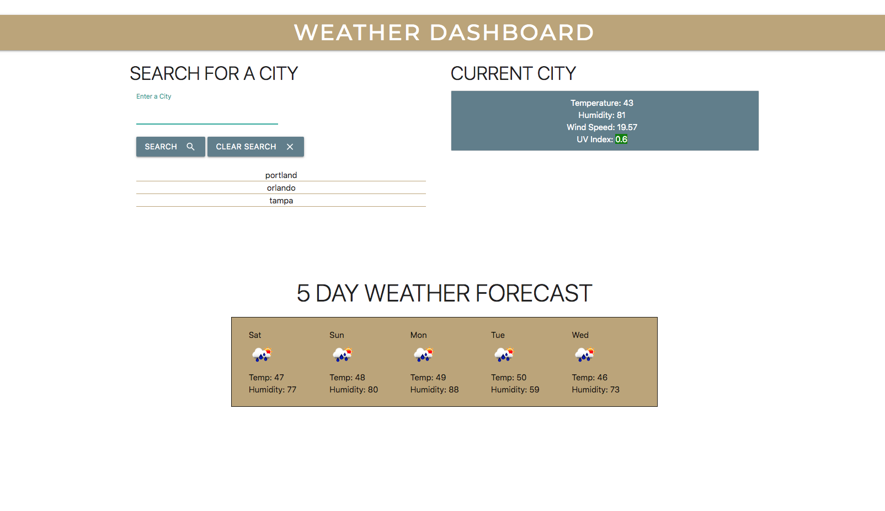

# Weather_Dashboard

Create a weather dashboard where users can enter in a city name and it will display the current weather and the 5 day forecast. Their list of searches will be saved in a list which they can then click back through.

## Table of Contents
* [Add Links into the HTML file](#Add-links-into-the-HTML-file)
* [Add External CSS & JS Files](#Add-external-CSS-and-JS-files)
* [Create a Functional Home Page](#Create-a-functional-home-page-with-an-hourly-calender)
* [Providing a URL for the Website](#Providing-a-URL-for-the-Website)
* [Credits](#Credits)

## Add Links into the HTML file
1. Add Materialize Reference Links for CSS and JS from the materialize webpage
2. Add in the jQuery links
3. Add in Google Fonts in CSS

## Add external CSS and JS files
1. Create and add the external CSS style sheet to the index.html file
2. Create and add the script tag for the JS file to the index.html file

## Create a functional home page 
1. Use the open weather API to gather the data
2. Use local storage to display the city searches that a user has already searched for

## Providing a URL for the website
1. Open Github.com
2. Create a new repository
3. Add a repository name and optional description
4. Make the repo public and add a README
5. Create repository
6. Inside the repo go to settings, scroll down to GitHub Pages and publish your site to the Branch: main

[GitHub Live Site](https://marisanesmith.github.io/Weather_Dashboard/)
